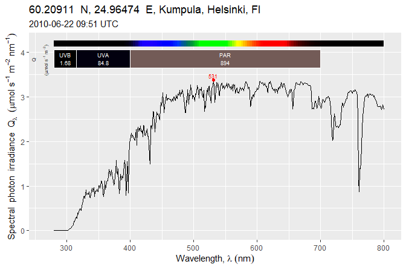

<!-- README.md is generated from README.Rmd. Please edit that file -->

# ggspectra 

[](https://cran.r-project.org/package=ggspectra)
[](https://cran.r-project.org/web/checks/check_results_ggspectra.html)
[](https://aphalo.r-universe.dev/ggspectra)
[](https://github.com/aphalo/ggspectra/actions)
[](https://docs.r4photobiology.info/ggspectra/)
[](https://doi.org/10.32614/CRAN.package.ggspectra)

The goal of ‘ggspectra’ is to make it easy to plot radiation spectra and
similar data, such and transmittance, absorbance and reflectance
spectra, producing fully annotated publication- and presentation-ready
plots. It is an extension to packages ‘ggplot2’ and ‘photobiology’, and
part of the ‘r4photobiology’ suite.

Package ‘ggspectra’ provides stats, geoms, scales and functions to be
used for plotting radiation-related spectra and annotating the plots
with quantities derived from spectral data. All summary quantities
implemented in ‘photobiology’ can be used for annotations including
biologically effective irradiances and exposures.

Please, see the web site
[r4photobiology](https://www.r4photobiology.info) for details on other
packages available as part of the suite, and on how to install them.

## Examples

Plotting spectra with an specialization of the `autoplot()` method
provides the most automatic approach. The specializations provided
support the classes defined in package ‘photobiology’, both for
individual spectra and for collections of spectra.

``` r
library(ggspectra)
autoplot(sun.spct)
```

<!-- -->

Some degree of flexibility can be obtained by passing arguments.

``` r
autoplot(sun.spct, annotations = c("+", "title:where:when"), unit.out = "photon")
```

<!-- -->

Maximum flexibility is achieved when building a plot layer by layer
using the grammar of graphics approach, as implemented in ‘ggplot2’, but
taking advantage of the specialized `ggplot()` methods, *geometries*,
*statistics* and *scales* specialized for the plotting of spectra,
defined in this package. Although designed with the classes defined from
package ‘photobiology’ in mind, geometries, statistics and scales can
also be used with data stored in other formats, as long as the user pays
attention to the expected units and bases of expression expected.

``` r
ggplot(sun.spct, unit.out = "photon") +
  geom_spct() +
  scale_y_s.q.irrad_continuous() +
  scale_x_wl_continuous(sec.axis = sec_axis_w_number()) +
  theme_bw()
```

<!-- -->

## Installation

Installation of the most recent stable version from CRAN:

``` r
install.packages("ggspectra")
```

Installation of the current unstable version from GitHub:

``` r
# install.packages("remotes")
remotes::install_github("aphalo/ggspectra")
```

## Documentation

HTML documentation is available at
(<https://docs.r4photobiology.info/ggspectra/>), including additional
on-line-only articles.

News on updates to the different packages of the ‘r4photobiology’ suite
are regularly posted at (<https://www.r4photobiology.info/>).

Two articles introduce the basic ideas behind the design of the suite
and its use: Aphalo P. J. (2015)
(<https://doi.org/10.19232/uv4pb.2015.1.14>) and Aphalo P. J. (2016)
(<https://doi.org/10.19232/uv4pb.2016.1.15>).

A book is under preparation, and the draft is currently available at
(<https://leanpub.com/r4photobiology/>). The book contains many examples
of plots created with ‘ggspectra’.

A handbook written before the suite was developed contains useful
information on the quantification and manipulation of ultraviolet and
visible radiation: Aphalo, P. J., Albert, A., Björn, L. O., McLeod, A.
R., Robson, T. M., & Rosenqvist, E. (Eds.) (2012) Beyond the Visible: A
handbook of best practice in plant UV photobiology (1st ed., p. xxx +
174). Helsinki: University of Helsinki, Department of Biosciences,
Division of Plant Biology. ISBN 978-952-10-8363-1 (PDF),
978-952-10-8362-4 (paperback). PDF file available from
(<https://doi.org/10.31885/9789521083631>).

## Contributing

Pull requests, bug reports, and feature requests are welcome at
(<https://github.com/aphalo/ggspectra>).

## Citation

If you use this package to produce scientific or commercial
publications, please cite according to:

``` r
citation("ggspectra")
#> To cite package ‘photobiology’ in publications use:
#> 
#>   Aphalo, Pedro J. (2015) The r4photobiology suite. UV4Plants Bulletin,
#>   2015:1, 21-29. DOI:10.19232/uv4pb.2015.1.14
#> 
#> A BibTeX entry for LaTeX users is
#> 
#>   @Article{,
#>     author = {Pedro J. Aphalo},
#>     title = {The r4photobiology suite},
#>     journal = {UV4Plants Bulletin},
#>     volume = {2015},
#>     number = {1},
#>     pages = {21-29},
#>     year = {2015},
#>     doi = {10.19232/uv4pb.2015.1.14},
#>   }
```

## License

© 2015-2025 Pedro J. Aphalo (<pedro.aphalo@helsinki.fi>). Released under
the GPL, version 2 or greater. This software carries no warranty of any
kind.
